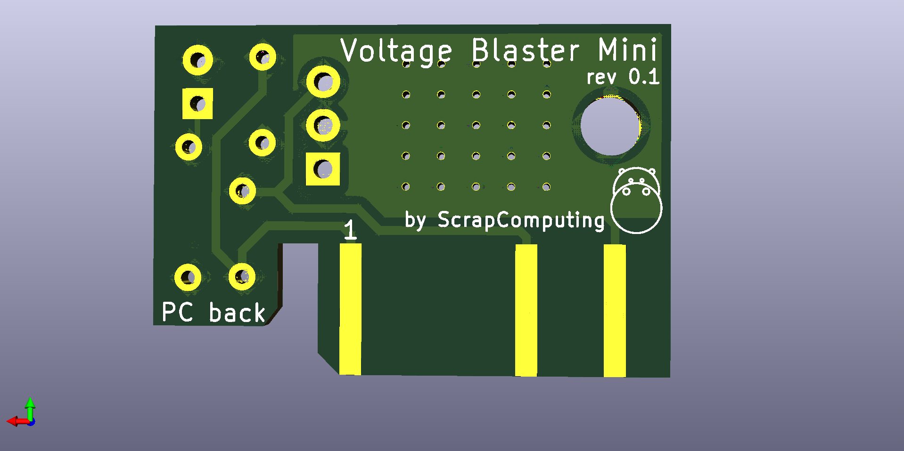

# Voltage Blaster Mini

Voltage Blaster Mini is a smaller version of the Voltage Blaster by
Phil's Computer Lab and Necroware. It is a tiny ISA card that provides -5V.

For more information about the original Voltage Blaster please refer to <https://github.com/necroware/voltage-blaster>.

# How does it work ?

The input to the LM7905 voltage regulator are pins B1 (GND) and B7 (-12V).
The output is pin B5 (-5V).

The resistor and the LEDs are optional. They are only used to indicate that -5V
is being generated by the regulator.

# Bill of materials

Item                            | #   | Description
--------------------------------|-----|--------------------------------------------------------
LM7905                          | 1   | Negative 5 Volts Voltage Regulator
10 uF ceramic capacitors        | 2   |
1K 1/4 watt resistor            | 1   | (Optional) You can use smaller for a brighter LED
LED                             | 1   | (Optional) Indicator light that -5V is being generated

